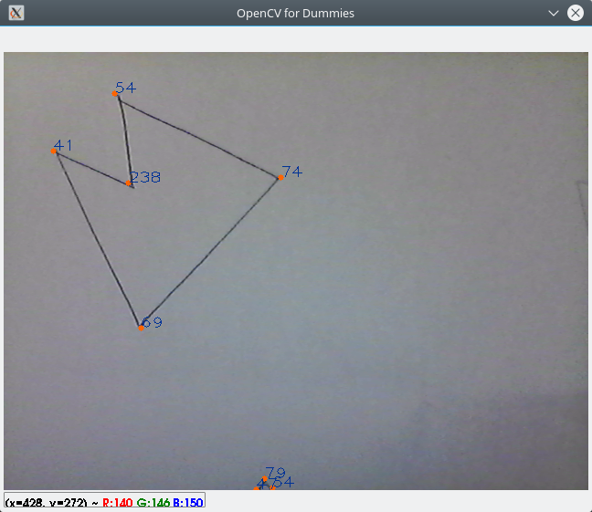

# Goniometer
The application determines the angles of the polygon on the input image.

## Installation
```sh
pip install -r requirements.txt
```
Run *angledrawer.py* to test your environment. You should see the pic.jpg with the angles labelled.

## Usage
Run *main.py*. Put a drawn polygon in front of your primary camera. You will get the angles in degrees labelled.
